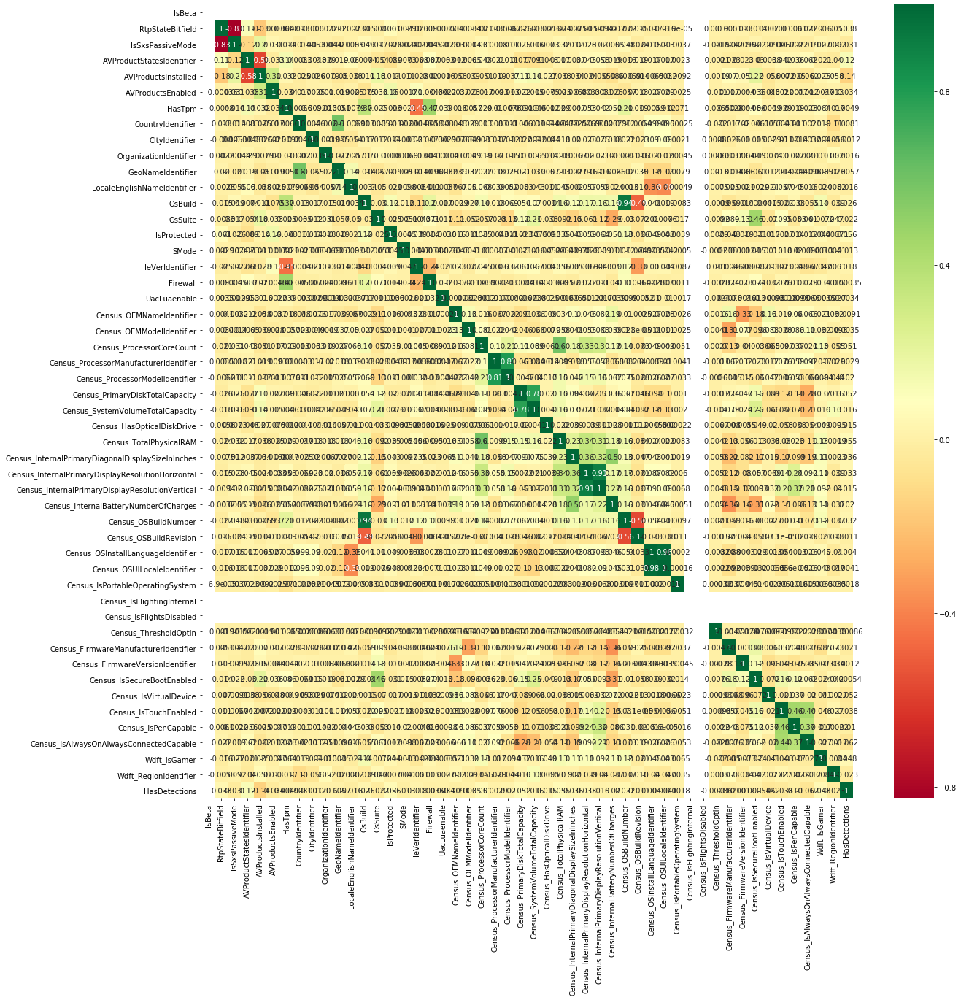
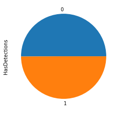
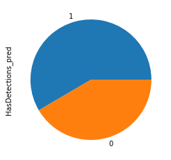

# Using supervised learning to predict the probibility of a malware

```python
import pandas as pd
import numpy as np
import lightgbm as lgb
from sklearn.ensemble import ExtraTreesClassifier
import matplotlib.pyplot as plt
```

# Explicitly defining the data types to reduce load and memory when reading 8Gb CSV file


```python
dtypes = {
        'MachineIdentifier':                                    'category',
        'ProductName':                                          'category',
        'EngineVersion':                                        'category',
        'AppVersion':                                           'category',
        'AvSigVersion':                                         'category',
        'IsBeta':                                               'int8',
        'RtpStateBitfield':                                     'float16',
        'IsSxsPassiveMode':                                     'int8',
        'DefaultBrowsersIdentifier':                            'float16',
        'AVProductStatesIdentifier':                            'float32',
        'AVProductsInstalled':                                  'float16',
        'AVProductsEnabled':                                    'float16',
        'HasTpm':                                               'int8',
        'CountryIdentifier':                                    'int16',
        'CityIdentifier':                                       'float32',
        'OrganizationIdentifier':                               'float16',
        'GeoNameIdentifier':                                    'float16',
        'LocaleEnglishNameIdentifier':                          'int8',
        'Platform':                                             'category',
        'Processor':                                            'category',
        'OsVer':                                                'category',
        'OsBuild':                                              'int16',
        'OsSuite':                                              'int16',
        'OsPlatformSubRelease':                                 'category',
        'OsBuildLab':                                           'category',
        'SkuEdition':                                           'category',
        'IsProtected':                                          'float16',
        'AutoSampleOptIn':                                      'int8',
        'PuaMode':                                              'category',
        'SMode':                                                'float16',
        'IeVerIdentifier':                                      'float16',
        'SmartScreen':                                          'category',
        'Firewall':                                             'float16',
        'UacLuaenable':                                         'float32',
        'Census_MDC2FormFactor':                                'category',
        'Census_DeviceFamily':                                  'category',
        'Census_OEMNameIdentifier':                             'float16',
        'Census_OEMModelIdentifier':                            'float32',
        'Census_ProcessorCoreCount':                            'float16',
        'Census_ProcessorManufacturerIdentifier':               'float16',
        'Census_ProcessorModelIdentifier':                      'float16',
        'Census_ProcessorClass':                                'category',
        'Census_PrimaryDiskTotalCapacity':                      'float32',
        'Census_PrimaryDiskTypeName':                           'category',
        'Census_SystemVolumeTotalCapacity':                     'float32',
        'Census_HasOpticalDiskDrive':                           'int8',
        'Census_TotalPhysicalRAM':                              'float32',
        'Census_ChassisTypeName':                               'category',
        'Census_InternalPrimaryDiagonalDisplaySizeInInches':    'float16',
        'Census_InternalPrimaryDisplayResolutionHorizontal':    'float16',
        'Census_InternalPrimaryDisplayResolutionVertical':      'float16',
        'Census_PowerPlatformRoleName':                         'category',
        'Census_InternalBatteryType':                           'category',
        'Census_InternalBatteryNumberOfCharges':                'float32',
        'Census_OSVersion':                                     'category',
        'Census_OSArchitecture':                                'category',
        'Census_OSBranch':                                      'category',
        'Census_OSBuildNumber':                                 'int16',
        'Census_OSBuildRevision':                               'int32',
        'Census_OSEdition':                                     'category',
        'Census_OSSkuName':                                     'category',
        'Census_OSInstallTypeName':                             'category',
        'Census_OSInstallLanguageIdentifier':                   'float16',
        'Census_OSUILocaleIdentifier':                          'int16',
        'Census_OSWUAutoUpdateOptionsName':                     'category',
        'Census_IsPortableOperatingSystem':                     'int8',
        'Census_GenuineStateName':                              'category',
        'Census_ActivationChannel':                             'category',
        'Census_IsFlightingInternal':                           'float16',
        'Census_IsFlightsDisabled':                             'float16',
        'Census_FlightRing':                                    'category',
        'Census_ThresholdOptIn':                                'float16',
        'Census_FirmwareManufacturerIdentifier':                'float16',
        'Census_FirmwareVersionIdentifier':                     'float32',
        'Census_IsSecureBootEnabled':                           'int8',
        'Census_IsWIMBootEnabled':                              'float16',
        'Census_IsVirtualDevice':                               'float16',
        'Census_IsTouchEnabled':                                'int8',
        'Census_IsPenCapable':                                  'int8',
        'Census_IsAlwaysOnAlwaysConnectedCapable':              'float16',
        'Wdft_IsGamer':                                         'float16',
        'Wdft_RegionIdentifier':                                'float16',
        'HasDetections':                                        'int8'
        }
```


```python
train_df = pd.read_csv("train.csv", nrows=100000, dtype=dtypes, low_memory=True)
# For the demonstration I will only use 100,000 samples of the 8GB file (To reduce load time)
```

# Splitting data from nurmerical and categorical then replacing null values with placeholder of 0 or "missing" (for category data types)


```python
n_cols = [
        'IsBeta',                                           
        'RtpStateBitfield',                                 
        'IsSxsPassiveMode',                                
        'AVProductStatesIdentifier',                        
        'AVProductsInstalled',                              
        'AVProductsEnabled',                                
        'HasTpm',                                           
        'CountryIdentifier',                                
        'CityIdentifier',                                   
        'OrganizationIdentifier',                           
        'GeoNameIdentifier',                                
        'LocaleEnglishNameIdentifier',                      
        'OsBuild',                                          
        'OsSuite',                                          
        'IsProtected',                                  
        'SMode',                                            
        'IeVerIdentifier',                                  
        'Firewall',                                         
        'UacLuaenable',                                     
        'Census_OEMNameIdentifier',                         
        'Census_OEMModelIdentifier',                        
        'Census_ProcessorCoreCount',                        
        'Census_ProcessorManufacturerIdentifier',           
        'Census_ProcessorModelIdentifier',                  
        'Census_PrimaryDiskTotalCapacity',                  
        'Census_SystemVolumeTotalCapacity',                 
        'Census_HasOpticalDiskDrive',                       
        'Census_TotalPhysicalRAM',                          
        'Census_InternalPrimaryDiagonalDisplaySizeInInches',
        'Census_InternalPrimaryDisplayResolutionHorizontal',
        'Census_InternalPrimaryDisplayResolutionVertical',  
        'Census_InternalBatteryNumberOfCharges',            
        'Census_OSBuildNumber',                             
        'Census_OSBuildRevision',                           
        'Census_OSInstallLanguageIdentifier',               
        'Census_OSUILocaleIdentifier',                      
        'Census_IsPortableOperatingSystem',                 
        'Census_IsFlightingInternal',                       
        'Census_IsFlightsDisabled',                         
        'Census_ThresholdOptIn',                            
        'Census_FirmwareManufacturerIdentifier',            
        'Census_FirmwareVersionIdentifier',                 
        'Census_IsSecureBootEnabled',                       
        'Census_IsVirtualDevice',                           
        'Census_IsTouchEnabled',                            
        'Census_IsPenCapable',                              
        'Census_IsAlwaysOnAlwaysConnectedCapable',          
        'Wdft_IsGamer',                                     
        'Wdft_RegionIdentifier',                            
]

def FillCat(cols_to_use, df):
    for col in cols_to_use:
        df[col].fillna(0, inplace = True) 
        
FillCat(n_cols, train_df)
```


```python
c_cols = [
        'MachineIdentifier',                 
        'ProductName',                       
        'EngineVersion',                     
        'AppVersion',                        
        'AvSigVersion',                      
        'Platform',                          
        'Processor',                         
        'OsVer',                             
        'OsPlatformSubRelease',              
        'OsBuildLab',                        
        'SkuEdition',                        
        'PuaMode',                           
        'SmartScreen',                       
        'Census_MDC2FormFactor',             
        'Census_DeviceFamily',               
        'Census_ProcessorClass',             
        'Census_PrimaryDiskTypeName',        
        'Census_ChassisTypeName',            
        'Census_PowerPlatformRoleName',      
        'Census_InternalBatteryType',        
        'Census_OSVersion',                  
        'Census_OSArchitecture',             
        'Census_OSBranch',                   
        'Census_OSEdition',                  
        'Census_OSSkuName',                  
        'Census_OSInstallTypeName',          
        'Census_OSWUAutoUpdateOptionsName',  
        'Census_GenuineStateName',           
        'Census_ActivationChannel',          
        'Census_FlightRing'
]

def FillCat(cols_to_use, df):
    for col in cols_to_use:
        df[col] = df[col].cat.add_categories('Missing')
        df[col].fillna('Missing', inplace = True) 

FillCat(c_cols, train_df)
```

# Only keeping relevant features

# Deleting features with too much NaN-values

# Deleting features with highly unbalanced dimensions

# (example: “AutoSampleOptIn” where the value “0” is almost 100% present)


```python
train_df.shape
```


    (100000, 83)


```python
train_df.describe()
```


<div>
<style scoped>
    .dataframe tbody tr th:only-of-type {
        vertical-align: middle;
    }

    .dataframe tbody tr th {
        vertical-align: top;
    }

    .dataframe thead th {
        text-align: right;
    }
</style>
<table border="1" class="dataframe">
  <thead>
    <tr style="text-align: right;">
      <th></th>
      <th>IsBeta</th>
      <th>RtpStateBitfield</th>
      <th>IsSxsPassiveMode</th>
      <th>DefaultBrowsersIdentifier</th>
      <th>AVProductStatesIdentifier</th>
      <th>AVProductsInstalled</th>
      <th>AVProductsEnabled</th>
      <th>HasTpm</th>
      <th>CountryIdentifier</th>
      <th>CityIdentifier</th>
      <th>...</th>
      <th>Census_FirmwareVersionIdentifier</th>
      <th>Census_IsSecureBootEnabled</th>
      <th>Census_IsWIMBootEnabled</th>
      <th>Census_IsVirtualDevice</th>
      <th>Census_IsTouchEnabled</th>
      <th>Census_IsPenCapable</th>
      <th>Census_IsAlwaysOnAlwaysConnectedCapable</th>
      <th>Wdft_IsGamer</th>
      <th>Wdft_RegionIdentifier</th>
      <th>HasDetections</th>
    </tr>
  </thead>
  <tbody>
    <tr>
      <th>count</th>
      <td>100000.0</td>
      <td>100000.0</td>
      <td>100000.000000</td>
      <td>4890.000000</td>
      <td>100000.000000</td>
      <td>100000.0</td>
      <td>100000.0</td>
      <td>100000.000000</td>
      <td>100000.000000</td>
      <td>100000.000000</td>
      <td>...</td>
      <td>100000.000000</td>
      <td>100000.000000</td>
      <td>36341.0</td>
      <td>100000.000000</td>
      <td>100000.000000</td>
      <td>100000.00000</td>
      <td>100000.000000</td>
      <td>100000.000000</td>
      <td>100000.0</td>
      <td>100000.000000</td>
    </tr>
    <tr>
      <th>mean</th>
      <td>0.0</td>
      <td>NaN</td>
      <td>0.017630</td>
      <td>inf</td>
      <td>47700.253906</td>
      <td>NaN</td>
      <td>NaN</td>
      <td>0.987270</td>
      <td>108.188050</td>
      <td>78144.601562</td>
      <td>...</td>
      <td>32449.011719</td>
      <td>0.484990</td>
      <td>0.0</td>
      <td>0.006630</td>
      <td>0.125420</td>
      <td>0.03715</td>
      <td>0.057007</td>
      <td>0.271973</td>
      <td>NaN</td>
      <td>0.499280</td>
    </tr>
    <tr>
      <th>std</th>
      <td>0.0</td>
      <td>0.0</td>
      <td>0.131603</td>
      <td>inf</td>
      <td>14309.322266</td>
      <td>0.0</td>
      <td>0.0</td>
      <td>0.112107</td>
      <td>62.989406</td>
      <td>50376.859375</td>
      <td>...</td>
      <td>21489.925781</td>
      <td>0.499777</td>
      <td>0.0</td>
      <td>0.081116</td>
      <td>0.331196</td>
      <td>0.18913</td>
      <td>0.231812</td>
      <td>0.444824</td>
      <td>0.0</td>
      <td>0.500002</td>
    </tr>
    <tr>
      <th>min</th>
      <td>0.0</td>
      <td>0.0</td>
      <td>0.000000</td>
      <td>1.000000</td>
      <td>0.000000</td>
      <td>0.0</td>
      <td>0.0</td>
      <td>0.000000</td>
      <td>1.000000</td>
      <td>0.000000</td>
      <td>...</td>
      <td>0.000000</td>
      <td>0.000000</td>
      <td>0.0</td>
      <td>0.000000</td>
      <td>0.000000</td>
      <td>0.00000</td>
      <td>0.000000</td>
      <td>0.000000</td>
      <td>0.0</td>
      <td>0.000000</td>
    </tr>
    <tr>
      <th>25%</th>
      <td>0.0</td>
      <td>7.0</td>
      <td>0.000000</td>
      <td>788.000000</td>
      <td>49480.000000</td>
      <td>1.0</td>
      <td>1.0</td>
      <td>1.000000</td>
      <td>51.000000</td>
      <td>30886.000000</td>
      <td>...</td>
      <td>12463.000000</td>
      <td>0.000000</td>
      <td>0.0</td>
      <td>0.000000</td>
      <td>0.000000</td>
      <td>0.00000</td>
      <td>0.000000</td>
      <td>0.000000</td>
      <td>3.0</td>
      <td>0.000000</td>
    </tr>
    <tr>
      <th>50%</th>
      <td>0.0</td>
      <td>7.0</td>
      <td>0.000000</td>
      <td>1632.000000</td>
      <td>53447.000000</td>
      <td>1.0</td>
      <td>1.0</td>
      <td>1.000000</td>
      <td>97.000000</td>
      <td>77866.000000</td>
      <td>...</td>
      <td>33060.000000</td>
      <td>0.000000</td>
      <td>0.0</td>
      <td>0.000000</td>
      <td>0.000000</td>
      <td>0.00000</td>
      <td>0.000000</td>
      <td>0.000000</td>
      <td>10.0</td>
      <td>0.000000</td>
    </tr>
    <tr>
      <th>75%</th>
      <td>0.0</td>
      <td>7.0</td>
      <td>0.000000</td>
      <td>2290.000000</td>
      <td>53447.000000</td>
      <td>2.0</td>
      <td>1.0</td>
      <td>1.000000</td>
      <td>162.000000</td>
      <td>121270.000000</td>
      <td>...</td>
      <td>52312.000000</td>
      <td>1.000000</td>
      <td>0.0</td>
      <td>0.000000</td>
      <td>0.000000</td>
      <td>0.00000</td>
      <td>0.000000</td>
      <td>1.000000</td>
      <td>11.0</td>
      <td>1.000000</td>
    </tr>
    <tr>
      <th>max</th>
      <td>0.0</td>
      <td>8.0</td>
      <td>1.000000</td>
      <td>3196.000000</td>
      <td>70486.000000</td>
      <td>5.0</td>
      <td>4.0</td>
      <td>1.000000</td>
      <td>222.000000</td>
      <td>167953.000000</td>
      <td>...</td>
      <td>72091.000000</td>
      <td>1.000000</td>
      <td>0.0</td>
      <td>1.000000</td>
      <td>1.000000</td>
      <td>1.00000</td>
      <td>1.000000</td>
      <td>1.000000</td>
      <td>15.0</td>
      <td>1.000000</td>
    </tr>
  </tbody>
</table>
<p>8 rows × 53 columns</p>
</div>


```python
del train_df["AutoSampleOptIn"]
del train_df["DefaultBrowsersIdentifier"]
del train_df["Census_IsWIMBootEnabled"]
```

# Identifying feature importance, I will attempt to identify the top 10 features for my target variable "HasDetections"


```python
X = train_df[n_cols].iloc[:,:-1]  # Independent columns
y = train_df.iloc[:,-1]    # Target column i.e HasDetections
```

# Plotting the top 10 features 


```python
model = ExtraTreesClassifier(max_depth=3, n_estimators=1000, n_jobs = -1, oob_score = True, bootstrap = True)
model.fit(X,y)

#plot graph of feature importances for better visualization
feat_importances = pd.Series(model.feature_importances_, index = X.columns)
feat_importances.nlargest(10).plot(kind='barh')

plt.show()
```


Further investigating feature importance by identifying features which highly corrolate with the target variable


```python
import seaborn as sns
#get correlations of each features in dataset
corrmat = train_df.corr()
top_corr_features = corrmat.index
plt.figure(figsize=(20,20))
#plot heat map
g=sns.heatmap(train_df[top_corr_features].corr(),annot=True,cmap="RdYlGn")
```





```python
features = ['Wdft_IsGamer','AVProductStatesIdentifier','Census_PowerPlatformRoleName','OsBuild',
       'Processor','Census_ProcessorCoreCount','Census_InternalPrimaryDisplayResolutionVertical',
       'Census_ProcessorModelIdentifier','Census_IsTouchEnabled','Census_HasOpticalDiskDrive']

label = ["HasDetections"]
```


```python
from sklearn import model_selection
from sklearn.metrics import accuracy_score
from sklearn.metrics import mean_squared_error
from sklearn.model_selection import cross_val_score
from math import sqrt
from sklearn.metrics import r2_score
from sklearn.model_selection import train_test_split
```

# Splitting the data


```python
X = train_df[features]
y = train_df[label]

X_train, X_test, y_train, y_test = train_test_split(X, y, test_size=0.2, random_state=42)
```

# Using LightGBM as my model.

LightGBM is a gradient boosting framework that uses tree based learning algorithms. It is designed to be distributed and efficient with the following advantages:

>Faster training speed and higher efficiency.
>
>Lower memory usage.
>
>Better accuracy.
>
>Support of parallel and GPU learning.
>
>Capable of handling large-scale data.


```python
d_train = lgb.Dataset(X, label = y)

# Tuning parameters to reduce over fitting
best_hyp = {'boosting_type': 'gbdt',
 'class_weight': None,
 'colsample_bytree': 0.6027132059774907,
 'learning_rate': 0.010899921631042043,
 'min_child_samples': 145,
 'num_leaves': 156,
 'reg_alpha': 0.45996805852518485,
 'reg_lambda': 0.7336912016500579,
 'subsample_for_bin': 440000,
 'subsample': 0.5512957111882841}

model = lgb.LGBMClassifier(n_estimators=20000, n_jobs = -1, bjective = 'binary', random_state = 50, **best_hyp)
model.fit(X, y.values.ravel())
y_pred = model.predict(X)
```


```python
#convert probabilities into 0 or 1
for i in range(len(y_pred)):
    if y_pred[i] >= .5:       # setting threshold to .5
       y_pred[i] = 1
    else:  
       y_pred[i] = 0
```


```python
pd.DataFrame(y_pred).head()
```

# Test to see if data is under or over fitting
# If the RMSE (Root mean square error) for the train set is much higher than that of the test set, 
# It is likely that you've badly over fit the data (Visa versa for under fitting), 
# i.e. you've created a model that tests well in sample, but has little predictive value when tested out of sample.


```python
y_pred_train = model.predict(X_train)
y_pred_test = model.predict(X_test)

print("R2 Score: ")
print( r2_score(y_test, y_pred_test), r2_score(y_train, y_pred_train) )

if r2_score(y_test, y_pred_test) > r2_score(y_train, y_pred_train):
    print("Underfitting detected")
elif r2_score(y_test, y_pred_test) < r2_score(y_train, y_pred_train):
    print("Overfitting detected")
else:
    print("Perfect")
```

    R2 Score: 
    -0.2828123278264705 -0.28185849952301356
    Overfitting detected


# Cross-validation
Cross-validation is a technique used to protect against overfitting in a predictive model, particularly in a case where the amount of data may be limited. In cross-validation, you make a fixed number of folds (or partitions) of the data, run the analysis on each fold, and then average the overall error estimate.


```python
params = {}
params['boosting_type'] = 'gbdt'
params['class_weight'] = None
params['colsample_bytree'] = 0.6027132059774907
params['learning_rate'] = 0.010899921631042043
params['metric'] = 'l1'
params['min_child_samples'] = 145
params['num_leaves'] = 156
params['reg_alpha'] = 0.45996805852518485
params['reg_lambda'] = 0.7336912016500579
params['subsample_for_bin'] = 440000
params['reg_lambda'] = 0.5512957111882841

cv_results = lgb.cv(params, d_train, num_boost_round=300, nfold=5, verbose_eval=20, early_stopping_rounds=40)

print('\nBest num_boost_round:', len(cv_results['l1-mean']))
print('Best CV score:', cv_results['l1-mean'][-1])
```

    [20]	cv_agg's l1: 0.496633 + 4.45904e-05
    [40]	cv_agg's l1: 0.492674 + 0.000113578
    [60]	cv_agg's l1: 0.490286 + 0.000144092
    [80]	cv_agg's l1: 0.487931 + 0.000183955
    [100]	cv_agg's l1: 0.486035 + 0.000214648
    [120]	cv_agg's l1: 0.484187 + 0.000251625
    [140]	cv_agg's l1: 0.482592 + 0.000278941
    [160]	cv_agg's l1: 0.481135 + 0.0003025
    [180]	cv_agg's l1: 0.479837 + 0.000328634
    [200]	cv_agg's l1: 0.478782 + 0.000353242
    [220]	cv_agg's l1: 0.477923 + 0.000367369
    [240]	cv_agg's l1: 0.477128 + 0.000379162
    [260]	cv_agg's l1: 0.47652 + 0.000382842
    [280]	cv_agg's l1: 0.475957 + 0.000395002
    [300]	cv_agg's l1: 0.475457 + 0.000405497
    
    Best num_boost_round: 300
    Best CV score: 0.475456602643707


# Accuracy: The overall Accuracy of the model e.g. 0.80 == 80%
# Mean Square Error: The average difference between the predicted and actual results (closer to zero indicates higher accuracy)
# Root Mean Square Error: Square root of the Mean Square Error reducing complexity from O(n^2) to O(n)


```python
accuracy_lgbm = accuracy_score(y_pred,y)
mse = mean_squared_error(y_pred, y)
rmse = sqrt(mse)

print("Accuracy: " + str(accuracy_lgbm))
print("Mean Square Error: " + str(mse))
print("Root Mean Square Error: " + str(rmse))
```

    Accuracy: 0.67949
    Mean Square Error: 0.32051
    Root Mean Square Error: 0.5661360260573425


```python
y_pred = pd.DataFrame(y_pred)
train_df["HasDetections_pred"] = y_pred 
```

# Displaying Results


```python
actual = train_df["HasDetections"].value_counts()
actual.plot.pie();
print(actual)
```

    0    50072
    1    49928
    Name: HasDetections, dtype: int64





```python
prediction = train_df["HasDetections_pred"].value_counts()
prediction.plot.pie();
print(prediction)
```

    1    58463
    0    41537
    Name: HasDetections_pred, dtype: int64





# From the results it can be said that roughly 8000 PCs are more than likley to have a virus detected (1 == predicted a virus on the machine, 0 == predicted no virus on the machine)
# This model can be used to indicate a high priority response to eradicating the malware sooner rather than later, and preventing the likleyhood of putting the user's machine and personal information at risk
